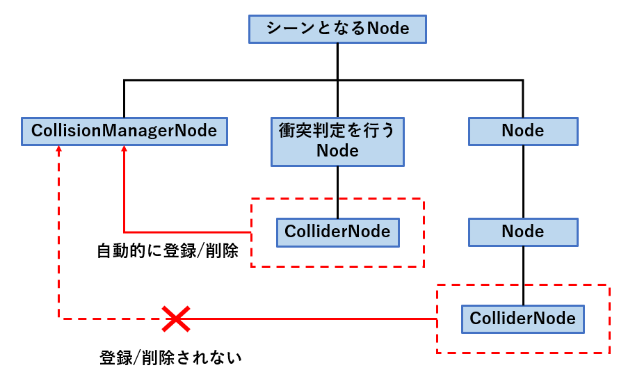
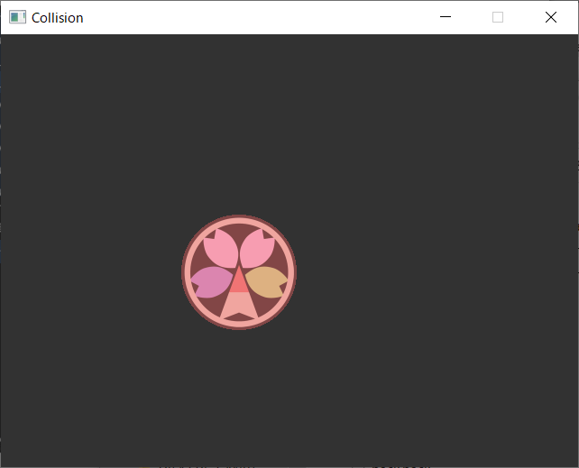

# 衝突判定

Altseed2では物理演算を用いて，2Dの衝突判定を行う機構が備わっています。  

## [Collider](xref:Altseed2.Collider)クラス

[Collider](xref:Altseed2.Collider)クラスは自身のメンバの情報をもとに他[Collider](xref:Altseed2.Collider)のインスタンスとの衝突の有無を判定します。  
[Collider](xref:Altseed2.Collider)と衝突判定の種類は以下の通りです。

|[Collider](xref:Altseed2.Collider)|衝突判定のタイプ|使用するメンバ|
|:---:|:---:|:---:|
|[CircleCollider](xref:Altseed2.CircleCollider)|円形|[中心](xref:Altseed2.Collider.Position)，[半径](xref:Altseed2.CircleCollider.Radius)|
|[PolygonCollider](xref:Altseed2.PolygonCollider)|多角形|[各頂点の座標](xref:Altseed2.PolygonCollider.Vertexes)|
|[RectangleCollider](xref:Altseed2.RectangleCollider)|短形|[左上の座標](xref:Altseed2.Collider.Position)，[サイズ(縦・横)](xref:Altseed2.RectangleCollider.Size)|

[Collider](xref:Altseed2.Collider)との衝突判定は[GetIsCollidedWith(Collider)](xref:Altseed2.Collider.GetIsCollidedWith(Altseed2.Collider))メソッドを使用します。  
指定したコライダと衝突していたらtrue，衝突していなかったらfalseを返します。  

## [ColliderNode](xref:Altseed2.ColliderNode)クラスと[CollisionManagerNode](xref:Altseed2.CollisionManagerNode)クラス

この2つのクラスによって，コライダの衝突判定を自動で行う事が出来ます。  

### [ColliderNode](xref:Altseed2.ColliderNode)クラス

このクラスは[Collider](xref:Altseed2.Collider)クラスを内部に持っています。  
また，この派生クラスに[CircleColliderNode](xref:Altseed2.CircleColliderNode)，[PolygonColliderNode](xref:Altseed2.PolygonColliderNode)，
[RectangleColliderNode](xref:Altseed2.RectangleColliderNode)クラスがあり，それぞれ[CircleCollider](xref:Altseed2.CircleCollider)，
[PolygonCollider](xref:Altseed2.PolygonCollider)，
[RectangleCollider](xref:Altseed2.RectangleCollider)クラスのインスタンスを内部に持っています。  
これらのクラスのプロパティを通して，内部コライダのメンバの操作を行う事が出来ます。  

> [!IMPORTANT]
> このクラスは，衝突判定を行いたいノード(シューティングゲームで言う自機や弾となるノード)の**子ノードとして**使用される必要があります。

### [CollisionManagerNode](xref:Altseed2.CollisionManagerNode)クラス

このクラスでは[ColliderNode](xref:Altseed2.ColliderNode)クラスのインスタンスが自動的に登録され，[GetIsCollidedWith(Collider)](xref:Altseed2.Collider.GetIsCollidedWith(Altseed2.Collider))メソッドを自動的に実行します。

> [!TIP]
> [GetIsCollidedWith(Collider)](xref:Altseed2.Collider.GetIsCollidedWith(Altseed2.Collider))メソッドによる衝突判定は，同じ[ColliderNode](xref:Altseed2.ColliderNode)の組み合わせに対して1フレームにつき1度しか行われません。

> [!IMPORTANT]
> このクラスは衝突判定を行いたいノードの**親ノードの子として**使用される必要があります。  
> また，1つのノードに対して，[CollisionManagerNode](xref:Altseed2.CollisionManagerNode)クラスのインスタンスは1つしか子として持つ事が出来ません。(登録しようとした場合は例外がスローされます。)

### 実装の形式

[ColliderNode](xref:Altseed2.ColliderNode)クラスと[CollisionManagerNode](xref:Altseed2.CollisionManagerNode)クラスはそれぞれ以下の図のような関係でなければなりません。  

> [!CAUTION]
> [ColliderNode](xref:Altseed2.ColliderNode)の自動登録には，シーンとなるノードに対して，**[CollisionManagerNode](xref:Altseed2.CollisionManagerNode)が子ノードであり，かつ[ColliderNode](xref:Altseed2.ColliderNode)が孫ノードである**事が重要です。  
> それ以外の場合における[ColliderNode](xref:Altseed2.ColliderNode)の自動的な追加/削除は発生しません。

> [!NOTE]
> 衝突判定を行うノードが[ICollisionEventReceiver](xref:Altseed2.ICollisionEventReceiver)インターフェイスを実装している場合，
> 
> - 衝突の開始
> - 衝突の継続
> - 衝突の終了
> 
> においてそれぞれ対応したメソッドが呼び出されます。

以上の点を踏まえた実装は以下のサンプルコードの通りです。  

[!code-csharp[Main](../../Src/Samples/Physics/Collision.cs)]

#### 結果
衝突を開始したときに色が赤くなり，以降衝突している間回転します。  
衝突終了時には色が戻ります。

## 衝突範囲の描画

`ColliderVisualizeNodeFactory.Create(ColliderNode)`を使用することで，衝突領域を描画できるノードを取得できます。

> [!IMPORTANT]
> 得られたノードを，`Node.AddChildNode(Node)`で登録しなければ衝突判定の視覚化は行われません。
> 生成元の[ColliderNode](xref:Altseed2.ColliderNode)を[CollisionManagerNode](xref:Altseed2.CollisionManagerNode)の子にすることで，描画範囲を衝突範囲に同期することが出来ます。

> [!CAUTION]
> 衝突範囲の描画の同期は，元となる[ColliderNode](xref:Altseed2.ColliderNode)が[CollisionManagerNode](xref:Altseed2.CollisionManagerNode)の管理下にある必要があります。

使い方は以下のサンプルコードを参考にしてください。

[!code-csharp[Main](../../Src/Samples/Physics/ColliderVisualization.cs)]

このコードを実行すると以下のように円形の当たり判定が赤色で示されます。

