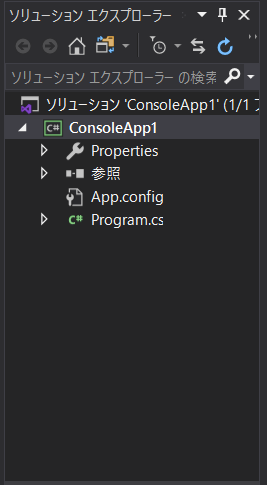
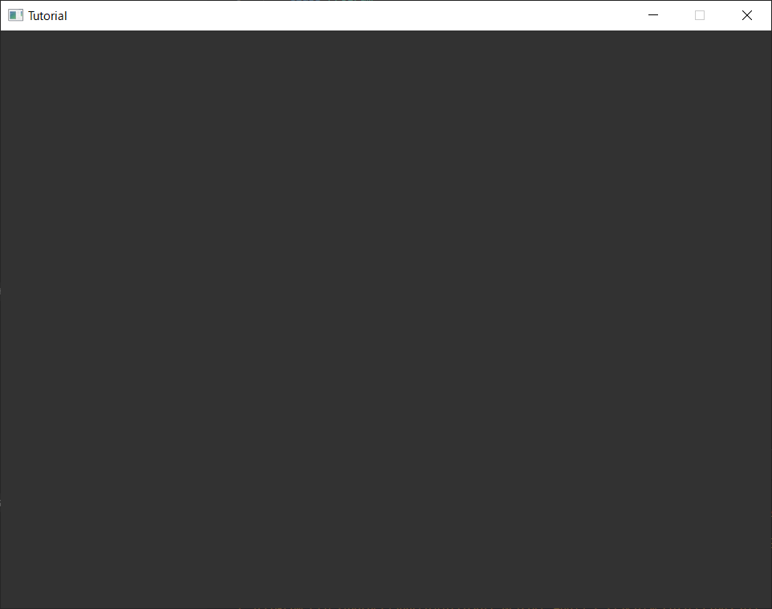

# 1章 : ウィンドウを表示してみよう

## この章の目標
この章の目標は、Altseed2を使ってウィンドウを表示することです。
プレイヤーや弾を描画する前に、そもそも「画像を表示するウィンドウ」がなければ何もできません。
そこで、最初にAltseed2を使ってウィンドウを表示してみましょう。

## 新たに導入する知識
本章で使用するC#の機能は下記のWebページに説明されています。  
必要次第参照してください。
- [C# によるプログラミング入門 : コメント](https://ufcpp.net/study/csharp/st_comment.html)
- [C# によるプログラミング入門 : 条件分岐](https://ufcpp.net/study/csharp/st_branch.html)  
  ここでは`if`文を使用します。
- [C# によるプログラミング入門 : 反復処理](https://ufcpp.net/study/csharp/st_loop.html)  

## ウインドウの表示
0章でVisualStudioのセットアップができたと思います。
VisualStudioの右側にソリューションエクスプローラーと呼ばれるものがあると思います。   
   
このProgram.csを開いてください。コードが表示されます。

ウィンドウを表示するプログラムは以下になります。 

[!code-csharp[Main](Spl1.cs)]

そのままコピーアンドペーストすると`namespace`が書き変わってしまうので`namespace`は変えないように気を付けてください。  

コードですが`using`や`namespace`などよくわからない単語がありますが、この辺りはまだそこまで気にしなくていいです。気になる方はこちらを読んでください。  
- [C# によるプログラミング入門 : 名前空間](https://ufcpp.net/study/csharp/sp_namespace.html)  

上のコードを実行します。VisualStudio画面上部の開始ボタンを押すか`F5`キーを押すことで実行することができます。
実行に成功すると以下のようなウィンドウが表示で来ると思います。  


コードの解説をしていきます。   
重要なのは`Main`の中です。C#では実行するとこのMainの中身が呼び出されます。ここが今回ウィンドウを表示させている部分です。

まず`Engine.Initialize `でAltseedの初期化をしています。
ここでウインドウに表示されるタイトルや画面サイズ、その他のオプション(フルスクリーンにするかどうか等)を設定できます。
この初期化はAltseedを使用する場合、必ず実行しなければいけません。
初期化に成功すると、ウインドウが表示されます。

今回は`Engine.Initialize("Tutorial", 960, 720); `となっています
`"Tutorial"`は表示されるウィンドウの名前、`960`は横幅、`720`は縦幅になります。  

これでAltseedはWindowを表示してくれるのですが、それだけではすぐにプログラムが終了してしまうので、プログラムが終了しないように`while`ループでEngineを更新させてあげる必要があります。  

`while (Engine.DoEvents()) `でウインドウが閉じられていないか確認することができます。
` Engine.DoEvents ` メソッドはウインドウが閉じられていない場合、正(`true`)、閉じられた場合、否(`false`)を返します。
`while`は`true`が返され続ける限り、` {} ` の中身を何度も実行し、`false`が返された場合、実行せずに ` {} ` の後に移動します。
ウインドウ右上の×ボタン等を押すと、`false`を返し、`while`の中身の実行を終了します。
 
`while`ループの中身を説明していきます。`Engine.Update()`というものがあると思います。これを実行することで`Altseed`が更新を続けることができます。  

もう一つ、Escキーを押したときにウィンドウを閉じる処理が書いてあります。
```C#
// Escapeキーでゲーム終了
if (Engine.Keyboard.GetKeyState(Keys.Escape) == ButtonState.Push)
{
  break;
}
```

` Engine.Keyboard.GetKeyState ` はキーの状態、例えば、「押されている」「押されていない」などを返すメソッドです。ここではEscキーの状態を返します。
`if`は`true`が返されると`{}`の中身を実行します。ここではキーの状態が ` ButtonState.Push ` だったら ` {} ` の中身を実行します。
` {} ` には ` break ` が書いてあります。これは`while`ループをその場で抜ける機能です。
`while`ループを抜けると、終了処理が実行されます。この時にウインドウが開いたままならば、自動的にウインドウを閉じます。
以下の通り ` ButtonState.Push ` 以外にも取得できるキーの状態があります。うまく組み合わせて使っていきましょう。

| キーの状態 | 説明 |
|:-----------|------------:|
| ` ButtonState.Free ` | キーを押していない状態 |
| ` ButtonState.Hold ` | キーを押している状態 |
| ` ButtonState.Push ` | ` Free ` から ` Hold ` に変わる瞬間の状態 |
| ` ButtonState.Release ` |　` Hold ` から　` Free ` に変わる瞬間の状態 |


## まとめ
1章では一番基本となるWindowの表示を行いました。  
2章ではウィンドウにキャラクターを描画していきます。