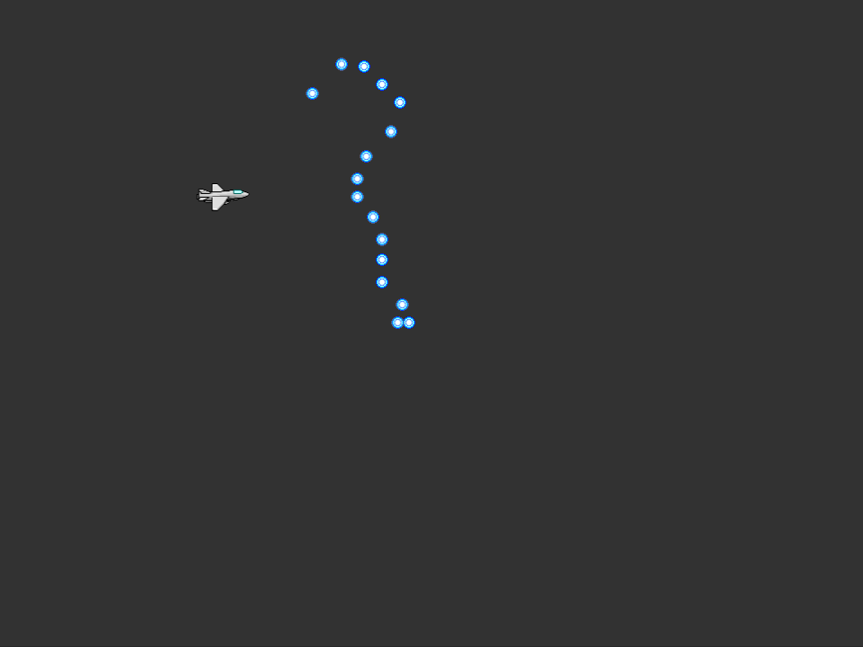
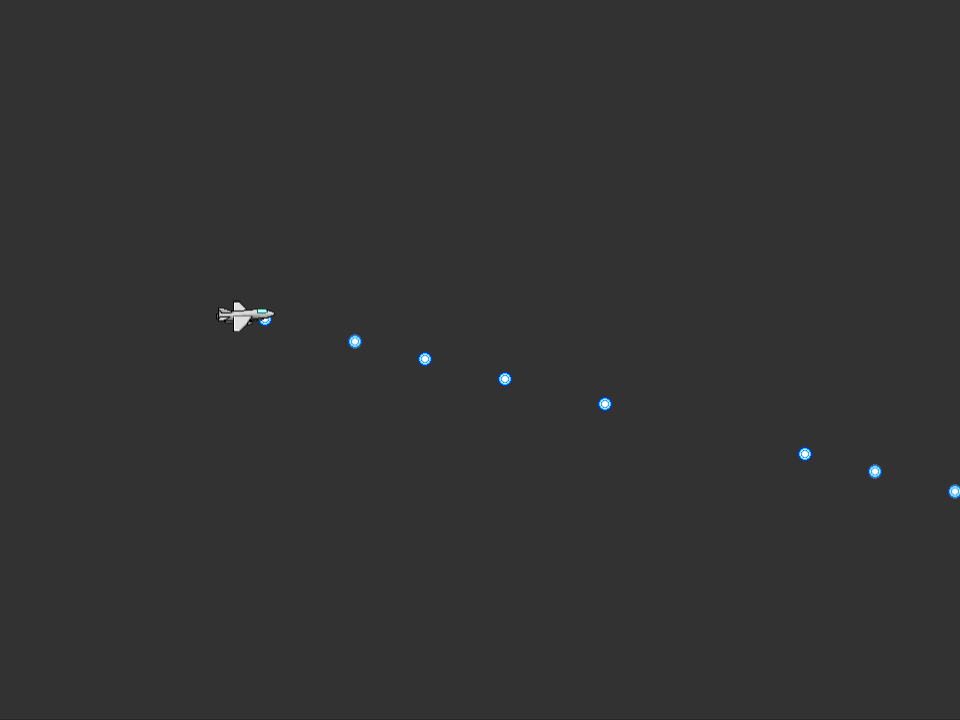

# 3章 : キャラクターに弾を撃たせてみよう

前章ではキャラクターの移動まで行いました。  
次は，シューティングゲームとして大事な要素の一つ，弾の発射を実装していきましょう。

## 弾の生成

まず以下のコードを追加します。

[!code-diff[Main](Text/Spl1.cs)]

結果，画像の様にZキーを押すたびに弾が生成されるようになりますが，まだ弾は動いていません。  
やっていることは前章と大して変わっていませんが，1つ見たことの無いものがありますね。

```cs
// 自機弾の表示位置を自機より奥に設定
bullet.ZOrder--;
```

`ZOrder`は，オブジェクトが手前側に描画されるか，奥側に描画されるかを表す数値です。  
小さいほど奥側に，大きいほど手前側に表示されます。
同じ値の場合は手前/奥側に表示されるかどうかは不定です。  

シューティングにおいては弾はプレイヤーや敵の奥側に表示されるものなので，`ZOrder`を`--`演算子を用いて1減らしています。



## 弾の移動

弾を動かすために以下のコードを追加します。

[!code-diff[Main](Text/Spl2.cs)]

これで発射された弾は右側に移動するようになりました。





ここでもまた始めてみるものが出てきました。

```cs
// 自機弾を格納するリスト
var list = new List<SpriteNode>();
```

`List<T>`は，"コレクション"と呼ばれるものの一つです。  
コレクションは，要素をまとめてくれるものです。  
例えば，`List<int>`であったら`int`型の整数を複数登録出来るものです。

`List<T>`は`Add`メソッドで末尾に要素を追加出来ます。
また，n番目に追加された要素を角括弧を用いて`list[n]`の様にして取得する事が出来ます。
更に，`list.Count`とすることで登録された要素の個数を取得することもできます。

```cs
// 自機弾を右に進める
for (int i = 0; i < list.Count; i++)
{
    list[i].Position += new Vector2F(10.0f, 0.0f);
}
```

先程追加されたコードのこの部分では番号を指定した要素の検索と一緒にfor文を用いています。  
このfor文というのはC#における繰り返し構文の一つで，while文に機能を足したようなものです。
forは

```cs
for (繰り返し処理の前に行う事; 繰り返す条件; 繰り返し処理の最後に行われる事)
{
    繰り返して行いたい処理
}
```

という風に書きます。
ここでは，`繰り返し処理の前に行う事`として`int i = 0`を行い，`int`型の変数を定義して値に0をセットしました。
`繰り返す条件`は`i < list.Count`となっており，`i`がリストの回数よりも小さいことが条件になっています。
`繰り返し処理の最後に行われる事`では，`i++`で`i`に1を加算しています。
この3つの記述によって，このfor文は**鉤括弧内の処理を`list.Count`回繰り返す**という意味を持ちます。
この

```cs
for (int i = 0; i < 繰り返し回数; i++)
{
    繰り返したい処理
}
```

という書き方はよく使います。
この書き方において`i`は，**繰り返しが何回行われたか**を意味します。
つまり，

```cs
// 自機弾を右に進める
for (int i = 0; i < list.Count; i++)
{
    list[i].Position += new Vector2F(10.0f, 0.0f);
}
```

では`list`内の要素を1つずつ取得して，それぞれの座標を右に動かしているのです。

ここで1つ疑問が浮かぶかもしれません。
あれ？`i`が0からスタートって，`list[0]`から始めるの？0番目っておかしくない？
となるかもしれませんが，`List<T>`において，検索する数字は0番目から始まります。
つまり，10個の要素が格納されている`List<T>`では，最初の要素は0番目に存在して最期の要素は9番目に存在しているという事です。

因みに，このfor文をwhile文に書き換えるとこんな感じになります。

```cs
int i = 0;
while (i < list.Count)
{
    list[i].Position = new Vector2F(10.0f, 0.0f);
    i++;
}
```

"指定回数繰り返す"という動作はfor文の方が便利なのでこちらを使うことをお勧めします。

## 他のコレクション

このチュートリアルでは以下のような`List<T>`以外のコレクションも使っていきます。
コレクションごとに特徴が多種多様で難しいため，余裕がない場合はここは後で読むくらいで構いません。

- 配列
- HashSet<T\>
- Queue<T\>

配列は`List<T>`とよく似ていますが，`Add`メソッドで要素の追加をするのではなく，`array[0] = 3;`のように直接代入することしかできません。
また，要素数は`Count`ではなく`Length`を用いて取得します。  

`HashSet<T>`は同じ要素を2つ以上格納できないコレクションです。つまり，`set.Add(3);`を何回行っても3は1つしか格納されていません。
また，`List<T>`や配列の様に何番目の要素は…と言った検索はできません。
その代わり，他のコレクションに比べ要素の追加や削除が高速で行えるという特徴があります。  

`Queue<T>`は"先入れ先出し"とも言われるコレクションで，`Enqueue`メソッドで末尾に要素を追加します。
要素を取り出すときは`Dequeue`メソッドを使用しますが，この操作で取り出せるのは先頭の要素です。
また，`Dequeue`メソッドで先頭の要素を取り出したとき，その要素は`Queue<T>`内から自動的に削除されます。