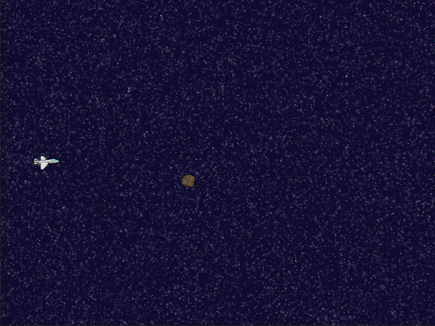
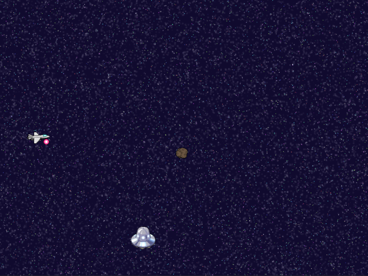
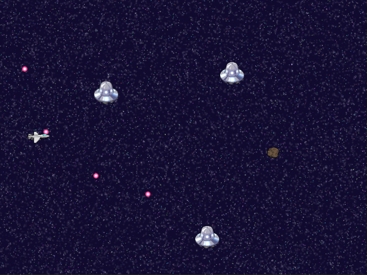
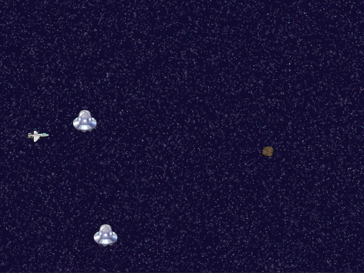

# 5章 : 敵・敵のショットを表示してみよう

今まではプレイヤーの挙動のみでした。
次は敵の実装を行います。

本章では継承を使用します。
確かに、今までも既存のクラスを継承することはありました。
この継承元のクラスは自分でも作成できます。

敵は様々な挙動をしますが、それぞれ個別に実装するのも管理するのも大変です。
それらを共通化するために継承があります。

## 敵クラスの実装

まずは敵を実装します。
基本的にはプレイヤーと変わりません。
プレイヤーとの違いとして、プレイヤーを攻撃するためにプレイヤーへの参照を持っていること、画面外にでたら自動的に消えることが違います。
画面外にでても常に敵が残り続けると、敵が多すぎて重くなってしまいます。
そのため、画面外に出たら消えるようになっています。

Enemy.csを追加し、下記のコードを記述します。

- Enemy.cs

[!code-diff[Main](Enemy.cs)]

前章では、`protected`や`public`の説明をしていませんでした。
これらはアクセス指定子といいます。
そのメンバー変数やメソッドにクラスの外部から使用できるかを指定します。

`public`は外部から使用できる、`protected`は継承先を含めたクラス内、`private`、もしくは記述なしはクラス内のみ使用可能です。

今回の場合、Enemyクラスは継承して使用するので、多くのメンバー変数が`protected`になっています。

また、``` Parent?.RemoveChildNode(this); ``` という記述があります。
これは、

```cs
if(Parent != null)
    Parent.RemoveChildNode(this);
```

と同じ意味です。nullでなかったら、何らかの処理を記述する、ということが多々あるため、簡単に記述できるようになっています。

ただ、見ての通り、この敵は動きもしないし攻撃もしません。
それでは、このクラスを継承して敵を実装しましょう。

## 隕石

先ほどのEnemyクラスを継承して隕石クラスを記述します。
Meteor.csを追加し、下記のコードを記述します。

- Meteor.cs

[!code-diff[Main](Meteor.cs)]

隕石は移動するだけの敵です。
更新するごとに速度の分、位置を動かしていきます。
<!--
更新内で ```base.OnUpdate();``` を呼んでいます。
これは、継承元のOnUpdateを呼ぶという意味です。
継承元で、画面外に出たら消すという処理を行っているため、継承元のOnUpdateを呼ぶ必要があります。
-->

## 敵の出現

敵のクラスを用意しただけでは、敵は出現してくれません。
そこでMainNodeを編集して、敵が出現するようにします。

- MainNode.cs

[!code-diff[Main](MainNode_1.cs)]



## 弾を打つ敵

弾を打つ敵を用意しますが、その前に弾を共通化します。
味方の弾と敵の弾を全く異なるクラスにしてもいいですが、ほとんどの機能は共通なので同じようなコードが2箇所に書かれてしまいます。
そのため、弾クラスを用意して、それを継承するようにします。

前章で作成した弾クラスのコンストラクタを一部修正します。
弾の画像に関する部分を消しています。

- Bullet.cs

[!code-diff[Main](Bullet.cs)]

それに合わせて、プレイヤーのコードも変更します。
プレイヤーの弾クラスは弾クラスを継承するようにします。
それに合わせて、プレイヤーはプレイヤーの弾クラスを発射するようにします。

新たにBulletクラスを継承してPlayerBulletクラスを追加します。

- PlayerBullet.cs

[!code-diff[Main](PlayerBullet.cs)]

- Player.cs

PlayerBulletを撃つように変更します。

[!code-diff[Main](Player.cs)]

次に敵の弾と弾を打つ敵クラスを実装します。
基本的には味方が弾を打つ処理と、敵の移動を組み合わせたものになります。
それぞれ、敵の弾クラスは弾クラスを継承し、弾を打つ敵クラスは敵クラスを継承します。

- StraightShotEnemy.cs

[!code-diff[Main](StraightShotEnemy.cs)]

- EnemyBullet.cs

[!code-diff[Main](EnemyBullet.cs)]

この敵も出現するようにしましょう。
MainNodeに敵を追加します。

- MainNode.cs

[!code-diff[Main](MainNode_2.cs)]



## 他の敵

他の敵もそれぞれ実装します。

複数方向に打てる敵です。
経過時間を計測し、経過時間ごとに異なる方向に弾を打ちます。

- RadialShotEnemy.cs

[!code-diff[Main](RadialShotEnemy.cs)]

プレイヤーを追いかける敵です。
プレイヤーへの参照を使用し、プレイヤーのほうに近づきます。

- ChaseEnemy.cs

[!code-diff[Main](ChaseEnemy.cs)]

それぞれの敵を追加します。

[!code-diff[Main](MainNode_3.cs)]



## 続・敵の出現

いままでのだと、敵が一気に出現するし、そのあとにも敵は出現しないので面白くありません。
そこで複数の敵が順番に出るようにします。

ここでは``` Queue ``` というクラスを使用しています。
これはListと同じようなものですが、挙動が異なります。

Listは、常に内部のコレクションの最後に値を追加するのみで、追加した後は任意の値にアクセスできました。

一方、Queueは、内部のコレクションの最後に値を追加し、取得するときは一番最初に追加した値を取得して、その値をコレクションから取り除きます。

追加には、``` Enqueue ```、取り出しには、```Dequeue```を使用します。

例えば、下記のような挙動になります。

```cs

Queue<int> queue = new Queue<int>();

queue.Enqueue(1);
queue.Enqueue(2);

// この時点ではqueueの中身には1,2がある

int value = queue.Dequeue();

// 1が表示される。
// この時点ではqueueの中身には2がある
Console.WriteLine(value); 

```

これを使用して敵を管理します。

親ノードには敵を追加せず、Queueに敵ノードを追加します。
そして、一定時間ごとにQueueから敵ノードを取り出し、追加することで敵が徐々に出現するようにします。

[!code-diff[Main](MainNode_4.cs)]



## まとめ

ここでは敵の処理を実装しました。
ただ、この章で弾は打てるようになりましたが、一切攻撃は命中しません。
次章では、弾が命中するようにします。
